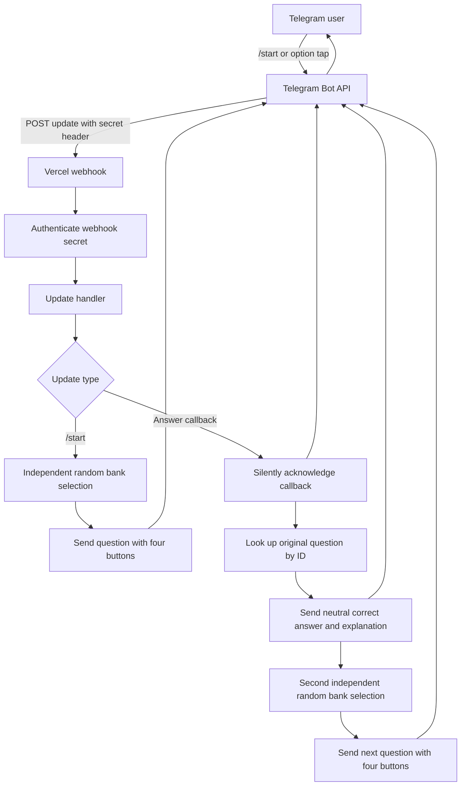

# Data Analyst Interview Bot

A Telegram practice bot for technical data-analyst interview preparation. It serves a randomly selected multiple-choice question from a static bank of 460 questions across SQL, Python/Pandas/EDA, statistics, Excel, and Tableau.

The bot has no database, scoring, history, or user profiles. Every selection is independent and uniform across the complete bank, so a question can repeat immediately.

## What happens in Telegram

1. Send `/start` to receive a random question with four tap-only choices.
2. Tap any choice.
3. The bot sends a neutral message containing the correct answer and explanation.
4. The bot immediately sends a separate next random question.

The bot does not label the selected choice as right or wrong and does not store progress.

## Request flow



## Question bank

| Topic | Questions |
| --- | ---: |
| SQL | 100 |
| Python, Pandas, libraries, and EDA | 180 |
| Statistics and hypothesis testing | 80 |
| Excel | 40 |
| Tableau | 60 |
| **Total** | **460** |

## Local validation

Prerequisite: Node.js 22 or newer.

```powershell
npm install
npm run test:run
npm run build
```

For a local webhook test, create a local `.env` file from `.env.example`, add your own values, and keep that file private. `.env` files are ignored by Git.

```powershell
Copy-Item .env.example .env
```

Do not use a real bot token in tests, commits, screenshots, or issue reports.

## Create the Telegram bot with BotFather

1. In Telegram, open **@BotFather** and choose **Start**.
2. Send `/newbot`, then follow the prompts to choose a display name and a unique username ending in `bot`.
3. BotFather displays the bot token once. Store it in a password manager or another private location.
4. Do not paste the token into this repository, GitHub, a chat, or a source file.

## Set Vercel environment variables

1. Create a Vercel project from this repository, or import it after it is published to GitHub.
2. In the Vercel project, open **Settings → Environment Variables**.
3. Add these values for the **Production** environment:

| Name | Value |
| --- | --- |
| `TELEGRAM_BOT_TOKEN` | Your private token from BotFather |
| `TELEGRAM_WEBHOOK_SECRET` | A private, random secret used only to authenticate Telegram webhook calls |

Generate the webhook secret locally if needed:

```powershell
node -e "console.log(require('node:crypto').randomBytes(32).toString('hex'))"
```

Keep both values in Vercel only. They are not required in GitHub and are never included in `.env.example` beyond their variable names.

## Production deployment

After the repository is connected to Vercel and both environment variables are saved, create a production deployment from the Vercel dashboard or a signed-in local terminal:

```powershell
vercel --prod
```

Copy the resulting production domain. The webhook URL must be:

```text
https://<YOUR_VERCEL_DOMAIN>/api/webhook
```

## Register the Telegram webhook

Run the following in a private PowerShell terminal after production deployment. The values stay only in the current terminal session; replace the placeholders locally and do not save the command with real values.

```powershell
$botToken = Read-Host 'Paste the BotFather token'
$webhookSecret = Read-Host 'Paste the Vercel webhook secret'
$webhookUrl = 'https://<YOUR_VERCEL_DOMAIN>/api/webhook'

Invoke-RestMethod -Method Post `
  -Uri "https://api.telegram.org/bot$botToken/setWebhook" `
  -ContentType 'application/json' `
  -Body (@{ url = $webhookUrl; secret_token = $webhookSecret } | ConvertTo-Json)
```

The result should report that the webhook was set successfully.

## Verify the live bot

1. Open the bot in Telegram and send `/start`.
2. Confirm that a question appears with four buttons.
3. Tap any button and confirm two follow-up messages arrive: the answer/explanation and then a new question.
4. If it does not respond, check Vercel’s Function logs and confirm the production environment variables are present.

To inspect the Telegram webhook configuration from the same private PowerShell session:

```powershell
Invoke-RestMethod -Method Get -Uri "https://api.telegram.org/bot$botToken/getWebhookInfo"
```

## Rotate or remove access

### Rotate a token or secret

1. Use BotFather’s token-management action to revoke the old bot token and obtain a new one.
2. Generate a new webhook secret.
3. Replace both Vercel Production environment-variable values and redeploy.
4. Run `setWebhook` again with the new token and secret.

### Disable the bot webhook

From a private terminal session containing `$botToken`:

```powershell
Invoke-RestMethod -Method Post `
  -Uri "https://api.telegram.org/bot$botToken/deleteWebhook" `
  -ContentType 'application/json' `
  -Body (@{ drop_pending_updates = $true } | ConvertTo-Json)
```

Then remove `TELEGRAM_BOT_TOKEN` and `TELEGRAM_WEBHOOK_SECRET` from Vercel and redeploy. If the bot is no longer needed, revoke its token in BotFather as well.

## Repository safety

- `.env`, `.env.*`, `.vercel`, build output, coverage output, and dependencies are ignored by Git.
- Only `.env.example` is tracked, and it contains names only—not secret values.
- Run the validation commands before publishing changes.

## License

MIT. See [LICENSE](LICENSE).
